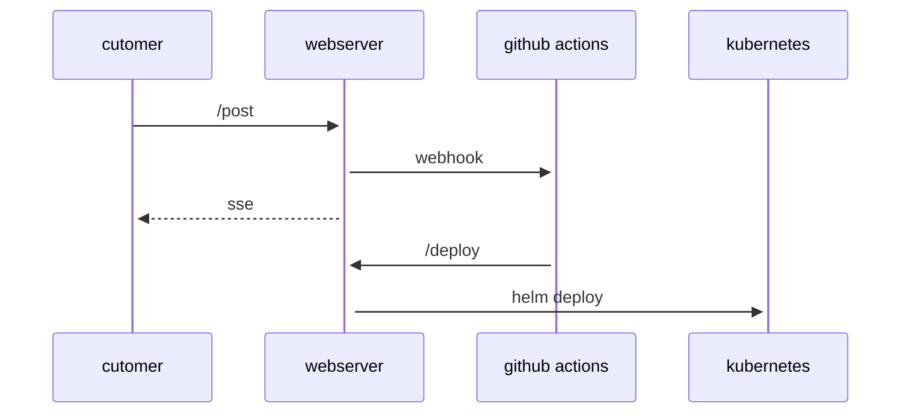
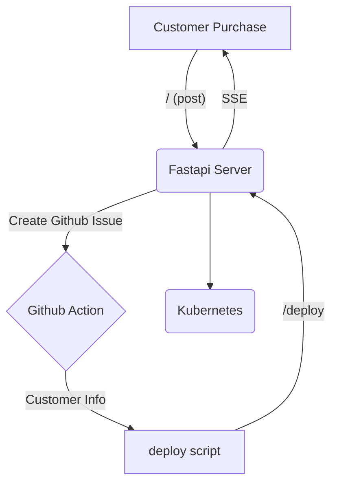

# SAS Interview Challenge

## Problem Statement

You are working for a SaaS company where customers can purchase your product.
When a customer completes their purchase, an automated pipeline should be triggered
that onboards them to the platform.

**The Goal:**
When the pipeline completes, the customer should be able to view a personalized
welcome screen that displays:

- Their company name
- Their company motto
- A "Welcome to SAS" message

**Scale Requirements:**

- Handle onboarding for 10-100 customers efficiently  
- Pipeline should be automated and reliable
- Solution should accommodate customer-specific data
- Consider how this scales as your customer base grows

## What We're Looking For

We want to see your DevOps thinking and problem-solving approach. You should:

- **Select 2-3 objectives** from the list below that interest you most
- **Create a script/solution** in any language you prefer (bash, python, groovy,
  yaml, etc.)
- **Demonstrate your understanding** of the chosen concepts
- **Document your approach** and reasoning

*Note: This does NOT need to be runnable code - pseudo code and well-commented
scripts are perfectly acceptable.*

## 10 Key Objectives to Consider

Choose a few objectives that align with your interests and expertise:

### 1. **Input Management**

Design how customer purchase events and metadata enter the pipeline. Define input
validation/normalization rules, idempotency to prevent duplicates, and secure
PII handling. Specify error handling, retry/backoff, and dead-letter routing for
malformed payloads.

### 2. **Data Deployment to Web Servers**

Design a mechanism for deploying customer-specific data (company name, motto) to
backend web servers running in Kubernetes. Consider how to package data into ConfigMaps
or Secrets, update pod configurations, and manage rolling deployments across multiple
web server pods without downtime.

### 3. **Data Management & Storage**

Design how to store and retrieve customer information (company names, mottos,
preferences). Consider databases, data validation, and data security.

### 4. **Scalable Web Serving**

Implement a Kubernetes-based web serving solution that can handle personalized pages
for 10-100+ customers. Consider pod autoscaling, service mesh configurations, ingress
controllers, and how to efficiently route traffic to customer-specific deployments.

### 5. **Pipeline Orchestration**

Design the workflow that coordinates all onboarding steps from purchase completion
to live customer page. Consider using tools like Github Workflows or Github Actions.
Along with task queues, error handling, and process monitoring.

### 6. **Security & Access Control**

Address security concerns for customer data and personalized pages. Consider
authentication, authorization, data encryption, and secure customer isolation.

### 7. **Monitoring & Health Checks**

Implement monitoring for the onboarding pipeline and customer pages running in
Kubernetes. Consider Prometheus metrics, Grafana dashboards, pod health checks,
service monitoring, and alerting for failed onboardings using tools like AlertManager.

### 8. **Configuration Management**

Design a system for managing customer-specific configurations in Kubernetes using
ConfigMaps, Secrets, and custom resources. Consider Helm charts for templating,
Kustomize overlays, and feature flags that might vary per customer tier or package.

### 9. **Infrastructure as Code**

Design Kubernetes infrastructure provisioning using tools like Terraform, Pulumi,
or GitOps with ArgoCD/Flux. Consider cluster setup, namespace management, RBAC
policies, and how to scale infrastructure for hosting customer pages and running
onboarding pipelines.

### 10. **Error Handling & Recovery**

Implement robust error handling for failed onboardings, partial completions, and
recovery mechanisms. Consider retry logic, manual intervention processes, and
customer communication.

## Your Deliverable

Create a folder/file structure that demonstrates your chosen objectives. For example:

- `my-solution/` directory
- Implementation script(s) in your preferred language
- Documentation explaining your approach
- Any configuration files or templates needed

## Notes Section

*Use this space as your scratch pad for ideas, architecture diagrams (ASCII art
welcome!), or planning notes.*

---

### Planning Notes

```text
I want to run all the infrustructure at a cost of zero dollars. The best way to do that is host the infrustructure on a machine i already own. I think my computer could probably handle 100 very small containers.
The main hurdle for running things locally is that i still want to use public github in some form to show i can create and use github actions. So i will use ngrok tunnels and some basic auth security so that the site on my machine doesn't get destroyed by the public internet. I also want to publically (at least briefly) host each of the new websites i make for customers. To do that i will need to update the ingress running for my web application dynamically as i spin up new pods for customer services.

Customer Data Flow:
- Customer uses a basic frontend that i created to take in name, motto and a purchase code.
- Customer submits thier information
    - key is authenticated
    - Webserver kicks off a call to my github issues where customer info is populated in to the issue
        - Github action is created based on a special create tag
        - Action calls a deployment script with customer info as args
- User submission and page is updated with latest deployment status using SSE
- *If i have time show a queue for how far back the current customer is

Pipeline Trigger Ideas:
- Trigger the pipline thourgh github issues
- use issues as an effective queue 
- isolate the action to only run one at a time
- action will trigger a build of the latest image on my machine
- action will generate a new helm chart on my machine
- action will update the ingress
- action will deploy new helm
- update status db on each step

Technology Choices:
- Github actions for the pipeline tool, because of public availabilty and i have some familiarity with them
- The customer data set is very small. so i'll use sqlite file for persistance
- I'll use fastapi for the webserver layer, because i've been learning it at work... so two birds.
- I'll use tailwind for styling, because there are a lot of examples and it is super simple.
- I'll use raw javascript for the frontend, because there is not a lot of frontend
- I will use docker desktop's kubernetes implimentation, because that is what i have installed
- I will use ngrok for tunnels because i have used it in the past a tiny bit and cloudflare tunnels were slightly more annoying to configure.

Challenges to Address:
- Running this for 0$
- How do i safely (mostly) expose my local application to the internet
- How do i validate create requests?
- What if onboarding fails mid-process?
- How to handle duplicate company names?
- hopefully i don't run out of free action runs on public github

```

### Architecture Sketches

Sequence diagram of data flow



Flow chart of the data flow



```text

Customer Journey:
1. Customer completes purchase
2. System captures company name + motto
3. Pipeline generates personalized page
4. Customer sees "Welcome [Company], [Motto]" page

```

### Implementation Ideas

```text
Example pipeline steps:
1. Receive purchase webhook
2. Extract customer data (company name, motto)
3. Generate personalized HTML page
4. Deploy/serve page at customer-specific URL
5. Send welcome email with link

Data structure ideas:
- Customer table: id, company_name, motto, created_at
- Page template: "Welcome {{company_name}}! {{motto}}"

```

---

*Good luck! We're excited to see your approach to solving this customer onboarding
pipeline challenge.*
